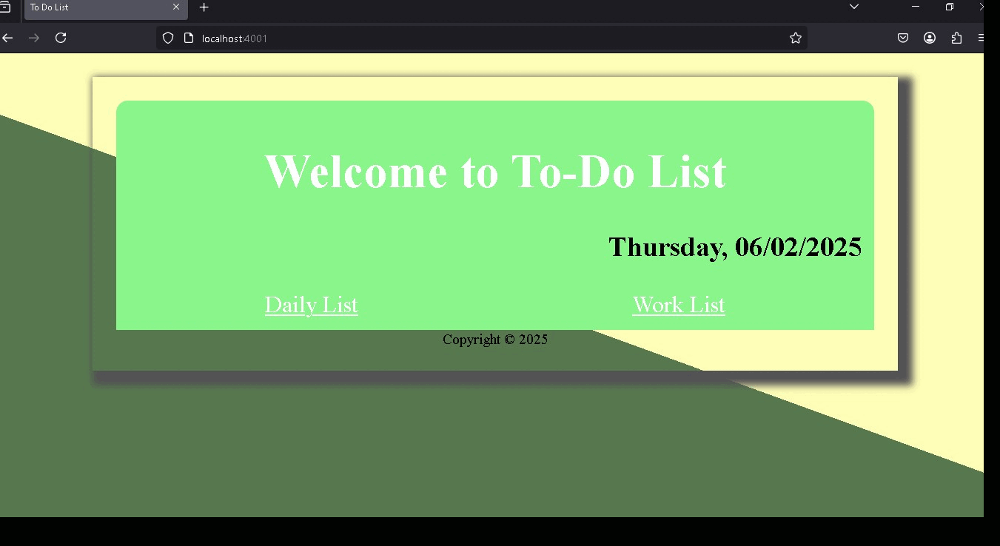

### Welcome to ***[To-Do List Web Application](https://github.com/Saras171/to-do-list.git)***

## Table of contents

- [Project Description](#project-description)
- [Features](#features)
- [Technologies Used](#technologies-used)
- [Installation](#installation)
- [Usage](#usage)
- [Future Enhancements](#future-enhancements)
- [Author](#author)
- [Contributing](#contributing)
- [Acknowledgments](#acknowledgments)
- [License](#license)
----

## Project Description

The To-Do List web application is a simple and efficient tool that allows users to manage their tasks effectively. Users can add, delete, and mark tasks as completed to stay organized.

## Features

- Add new tasks

- Delete tasks

- Mark tasks as completed

- Edit existing tasks

- Store tasks locally using localStorage

- 

## Technologies Used

- Frontend: HTML, CSS, Javascript, DOM

- Backend: Node.js, Express, EJS template

- For Data Storage: Postgres SQL

## Installation

1. Clone the repository:
```bash
git clone https://github.com/saras171/to-do-list.git
``` 

2. Navigate to the project directory:
```bash
cd todo-list
```
3. Install Dependencies:
 ```bash
npm install
```
4. Set up the PostgreSQL database:

- Install [PostgreSQL](https://www.postgresql.org/download/) if not already installed.

- Create a database named **"todo_list"**.

- Run the provided SQL script (on your pgAdmin QueryTool) from **"queries.sql"** file (included inside project folder) to create requisite tables.

- Update your **.env** file with the database credentials.

5. Start Backend Server, use **nodemon** for automatic Server restart and debugging:

```bash
nodemon index.js
```
- In case, you don't have nodemon package, then install nodemon:
```
npm install -g nodemon
```
- Your server must be running somewhere
`http://localhost:${your-port}`, go to browser and run your local server `http://localhost:${your-port}` such as `http://localhost:4001`.

## Usage

- Open the application in your browser.

- Enter a task in the input field and press Add symbol "+".

- Click on a task to mark it as completed.

- Use the delete button to remove a task.

## Future Enhancements

- User authentication

- Cloud storage for tasks

- Notifications and reminders

## Author
- LinkedIn: [@SaraswatiRawat](https://www.linkedin.com/in/saraswati-rawat-534a02184)
- GitHub Account: [@Saras171](https://github.com/saras171)

## Contributing

Contributions are welcome! Feel free to submit a pull request or report issues.

## Acknowledgments

I would like to give my sincere regards to my Web Developer Mentor **[Dr. Angela Yu](https://www.udemy.com/user/4b4368a3-b5c8-4529-aa65-2056ec31f37e/?srsltid=AfmBOoogSDbRCw3K3ukbfBqpWdYPs8gXdUV80NqjDPhFy3_2Nb9eQ-oo)** (from Udemy) for guiding me and inspire me to ameliorate my skills.


## License 

This project is licensed under the [Apache License](/LICENSE).


